# PNU UMC Server Study 1주차
## 강의
### 서버의 역할
serve 에 -er 접미를 붙혀 만든 server   
**홀 서빙**에서 음식을 가져다 주는 서빙을 생각하면 편하다   
프론트에서 오는 요청을 받고 그에 따라 정해진 응답을 하는 역할   

### APM?
서버를 구동시키기 위한 스택을 말함   
Apache + php + Mysql이 보통 궁합이 좋아 같이 따라오는 세트이다.   
* Apache는 웹 서버   
* php는 서버 구동 언어   
* Mysql은 DB를   

맡는다고 보면 된다.   
취향에 따라 원하는 스택으로 바꿀 수 있다.   

### 비트나미
APM을 알맞은 os로 설치를 도와주는 패키지   
Window를 사용하므로 WAMP(Windows-AMP)를 설치한다.   

---
## 챌런지 과제

1. **가상 머신을 설치하기**
    a. VM virtualBox, VMware 사용하기
2. **가상 머신에 리눅스 계열  OS 설치해 실행하기**
    a. Ubuntu, centOs 등등
3. **리눅스에 APM 소스 설치하기**
    a. 추천 검색 키워드 ‘Ubuntu APM 소스 설치’
    b. 패키지 설치 ↔ 소스 설치의 차이점 이해하기
    c. Apache - php - mysql 순서대로 천천히 해보는걸 추천합니다.   

### 가상 머신 및 os 설치
생략 - 미리 깔려 있었기 때문에   
but, 기존의 iso 파일이 사라져있었기 때문에 새로 받을 필요는 있었다.   
Oracle VM VirtualBox에 Ubuntu 20.04를 설치

**Trouble Shooting**
잔, 로아님 께서 메모리 40기가를 할당해도 부족하다고 하심
아래와 같이 디스크 고정할당을 통해 해결 가능   
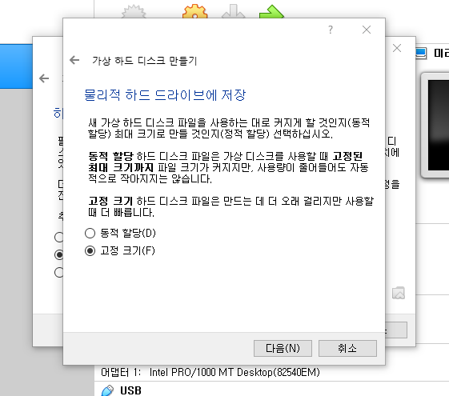

### 리눅스에 APM 소스 설치
**왜 소스 설치인가**

소스 코드로 컴파일 하여 설치를 하면 다음과 같은 이점이 있다.   
* 세밀한 설정 가능
* 더 안정적, 효율적

특히 안정성이 중요한 서버에서는 큰 이점으로 다가온다.   

순서대로 Apache - mysql - php 순으로 설치한다.   

### 경로
linux에서 root에 존재하는 /usr 폴더는 사용자가 실행할 프로그램들을 저장한다.    
그러므로 실습 때 설치할 모든 data는 /usr에서 관리되어야 한다.   
/usr 내부의 /local은 특히 소스로 컴파일 할 때 사용되는 장소다.   
그러므로 실습에서는 /usr/local 에서 모든 작업을 해야 한다.   

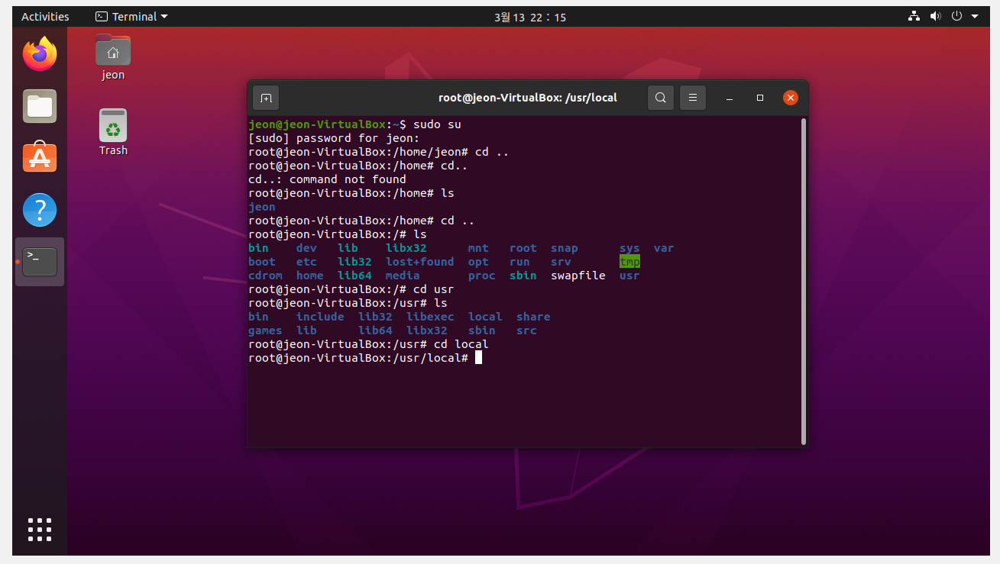

### Apache
https://httpd.apache.org/docs/2.4/en/install.html
정석대로 설치하고 싶으면 위의 link를 보고 하면 된다.   
**그러나** 너무 어려워서 수많은 블로그 글들을 참조 했다.   

받아야 할 소스는
* apr
* apr-util
* pcre
* apache

이다.   

apr은 Apache portable runtime으로 apache의 휴대용 라이브럴리이다.   
pcre는 Perl Compatible Regular Expressions으로 펄 호환 정규 표현식이다. 정규식 패턴 일치를 구현하는 함수의 집합이다.   

    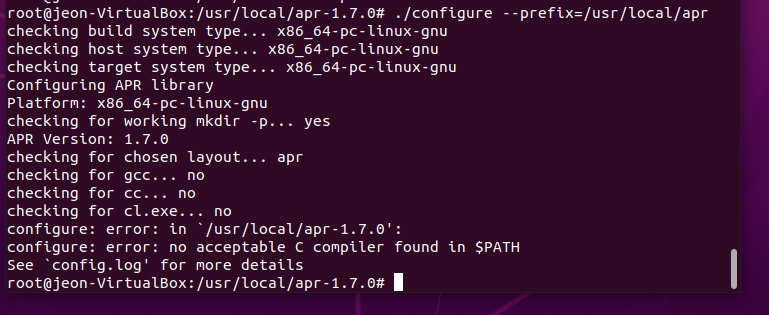
    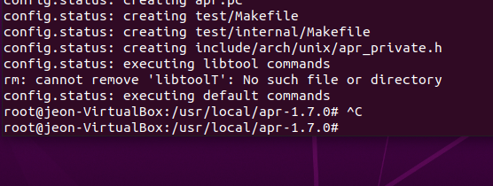

    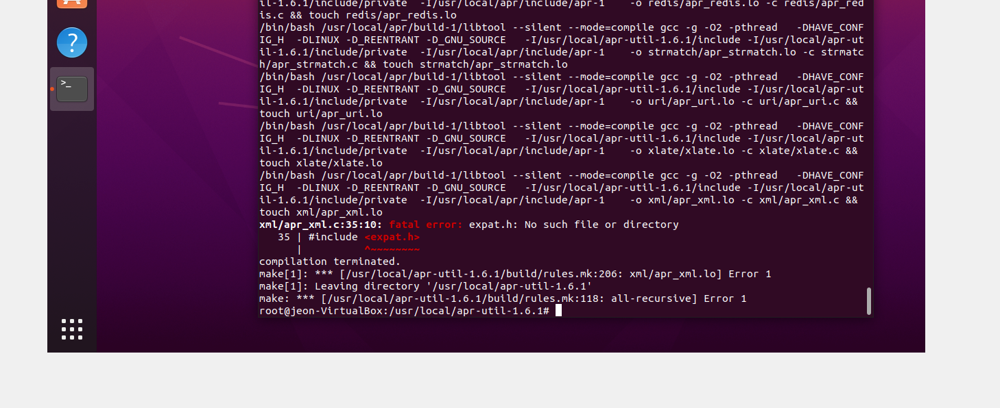
    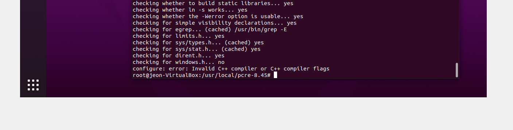

성공한 결과이다.   

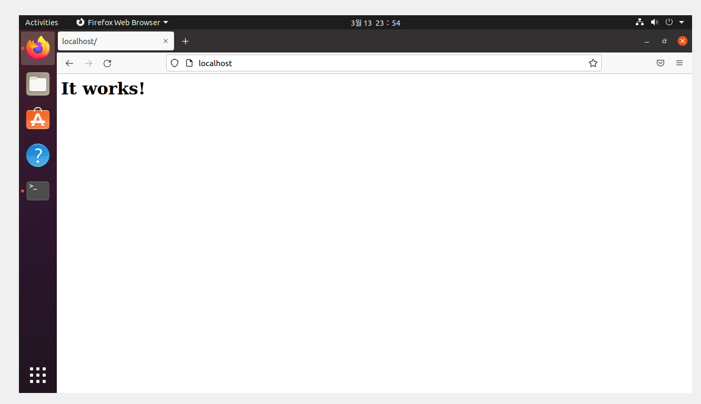   

### MySQL
엄청 오래 걸린다.   
겪었던 오류로는 boost 경로 지정이다.   
미리 boost를 받아 온 후 이를 경로 지정해준 후 설치하면 된다.   

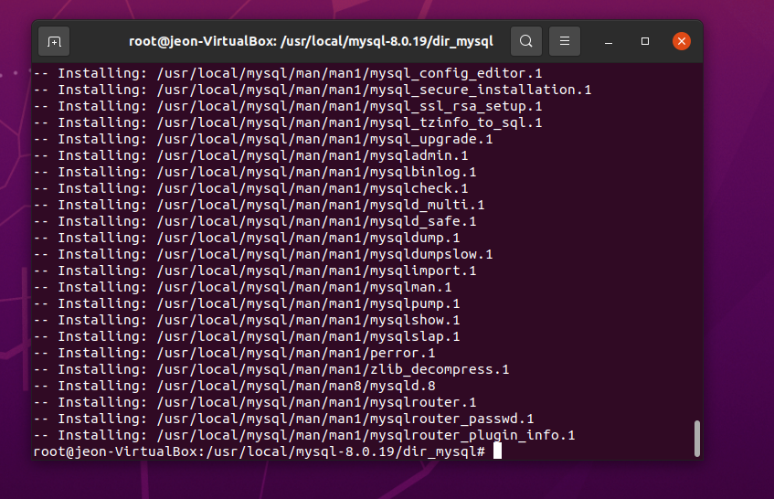
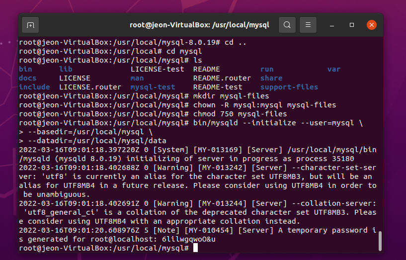
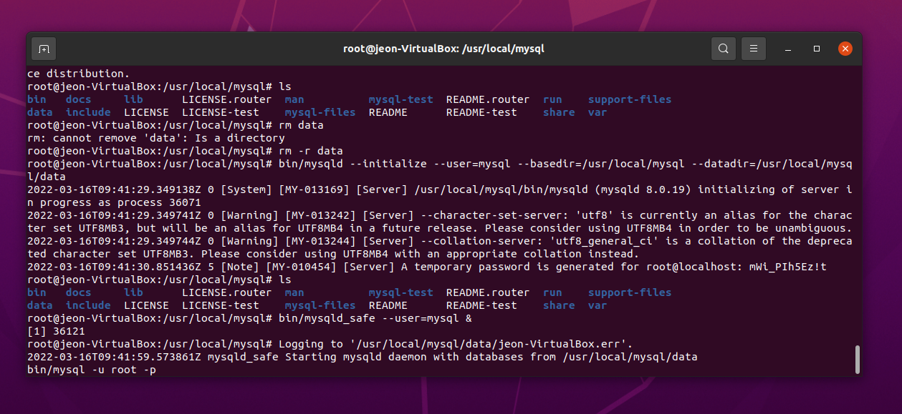
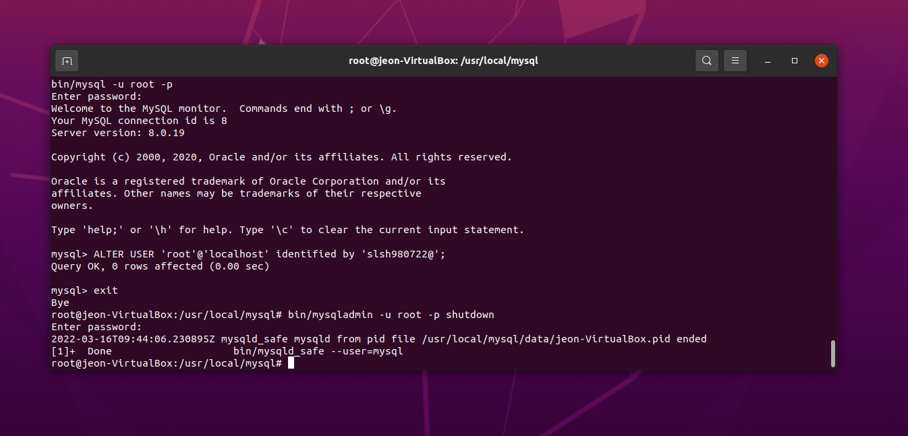

### php
php 또한 블로그 글을 따라 설치하였다.   
스스로 저지른 오타로 인한 오류를 제외하고는 기억나는 오류는 없었다.   
위 강의 실습 처럼 phpinfo.php를 작성한 후   
이를 apache와 연결하여 서버를 킨 후   
이를 켜보는 것으로 챌런지 과제를 완수했다.   

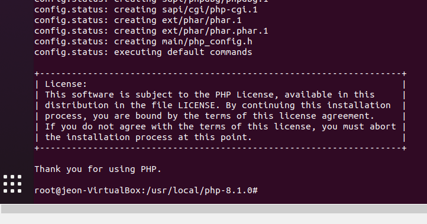
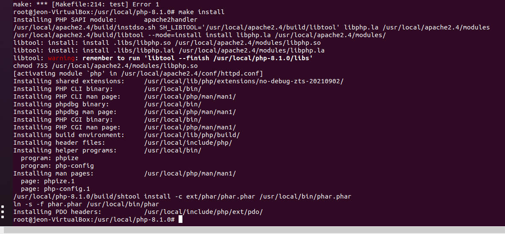
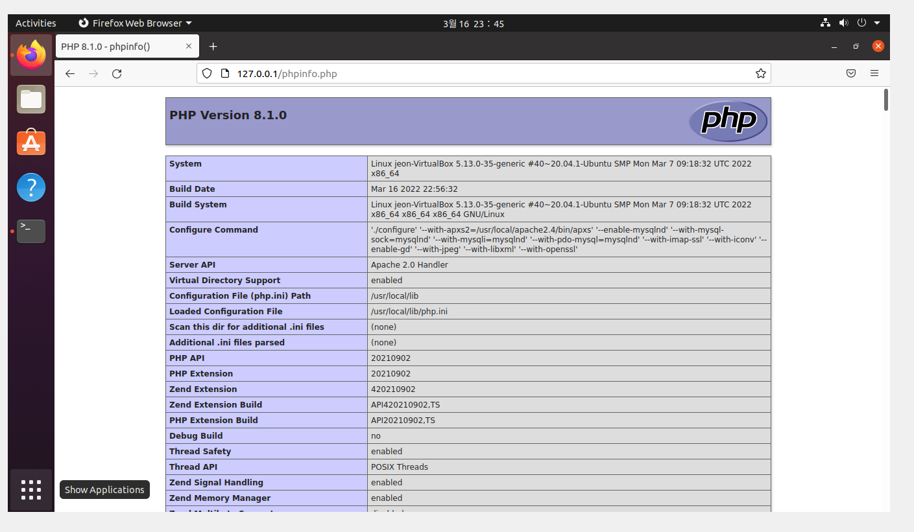
성공 완료   