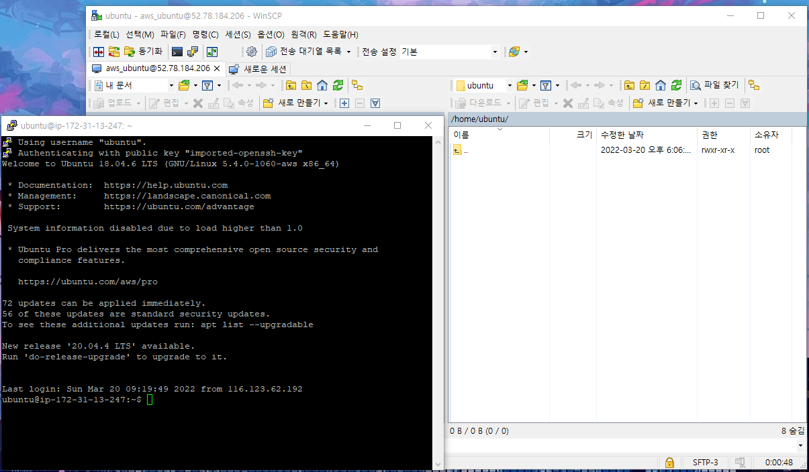

# PNU UMC Server Study 2주차
## 강의
### 포트포워딩
외부에서 사용 가능하게 포트을 열어 접근 가능하게 해주는 것   

### 프로토콜
컴퓨터 또는 컴퓨터 내부에서 데이터 교환 방식을 정의한 것

* http
  * WWW에서 html을 주고받는 데 쓰이는 프로토콜
  * 80번 포트
* https
  * http 에서 secure, 인증서 추가
  * 443 포트
* mysql
  * db 관리를 위해 주고받는 프로토콜
  * 3306 포트
* ssh
  * 쉘과 사용자 사이에 명령어를 주고받는 프로토콜
  * 22번
* ftp
  * TCP/IP 네트워크에서 파일 전송을 위한 프로토콜
  * 20, 21번, 둘이 열리는 방법이 다름
* sftp
  * ssh에서 파일 전송 담당
  * 포트 번호는 22번

### 포트포워딩 실습
공유기 아이피를 통해 공유기 설정 사이트를 접근하여 포트포워딩 해보기.   
최근 아파트 단지 내에 인터넷 공사 때문에 IP가 바뀜   
그래서 현재의 IP로는 접속이 불가함   
아마 공유기 초기화를 통해 재설정이 필요해 보임   

### AWS
아마존에서 제공하는 클라우딩 서비스   
가장 많은 사람들이 이용함.   

EC2 에서 인스턴스를 만드는 실습을 통해 접속이 가능했음.   
   
