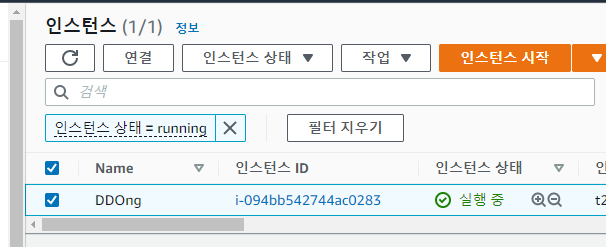

# PNU UMC Server Study 2주차

### https://ehddud100677.tistory.com/382?category=925801

## Protocol 이란?
client가 server에 요청을 하는 방식

## Protocol의 종류
**http** : 서버와 클라이언트가 인터넷상에서 데이터를 주고 받기 위한 프로토콜
        packet - header , body로 구성
**https** : http 에서 보안이 추가된 프로토콜
**mysql**: 
**ssh** : 네트워크상의 다른컴퓨터에 로그인하거나 원격시스템에서 사용하는 프로토콜
**ftp** : 파일전송 프로토콜
**sftp** : sftp는 ssh의 파일전송 버전이다.

## IP
도로명 주소  ---> 위도, 경도
    도메인           IP

port : 서버로 들어가는 출입문

http : 80

https: 443

ssh: 22

ftp: 21

sftp: 22 

mysql: 3306

sftp는 ssh의 파일전송 버전이다.

80 port는 default로 설정되어있다.

## Port Forwarding
외부 IP를 접속한 클라이언트가 특정 port로 요청을 하면 내부 IP로 보내서 처리를 하는 것이다.

외부 IP 80으로 접속을 하면 내부 IP 80으로 바꾸어준다.

오류가 나서 실패했다. 가상머신을 재 설치해야 될 것 같다.

## AWS 를 설치

윈도우에서는 WinSCP를 사용해서 연결을 해주어야했다.
