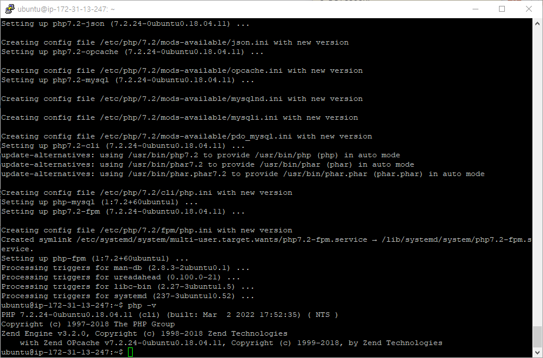

# PNU UMC Server Study 3주차
## 강의
### 도메인
인터넷 주소에서 각 주소를 구분할 수 있는 string   

### 서브 도메인
www.naver.com에서 m.naver.com의 차이점은   
앞에 오는 string이 다르다는 점   
각 서비스에서 여러 서비스들을 사용자가 접근할 수 있도록 해줌.   
먼저 선점될 경우 서브 도메인을 이용하는 경우도 있음   

### 리다이렉션
여러 주소로 들어올 때 하나의 통일된 주소로 바꿔주는 것   

## 실습
### nginx, php, mysql 설치   




설치가 완료 되었다.   

### nginx 와 php 연동하기   

   
   
   
nginx configure 하는 default 파일에서   
설정을 통해 연동 가능하다.

### 도메인 구입
"가비아" 나 "후이즈" 를 통해 도메인 구입이 가능하다.   
가비아 에서는 비교적 싼 .shop 도메인을 1년 550원에 구입이 가능하므로   
실습 영상과 같이 가비아를 이용했다.   
   
   

### 서브 도메인 적용하기   
   

/var/www/html 에서 서브도메인 별로 경로를 만든 후   
거기서 index.html을 만들어 h1 태그로 식별할 수 있게 적어준다.   
default 파일에서 각 서브 도메인 별로 설정해준다.   

### 리다이렉션 적용   
default 파일에서 설정 가능하다.   
사진으로는 리다이렉션이 작동되는 지 볼 수 없어 캡션을 생략했다.   

## 챌런지 과제 - https 적용  
### 패키지 설치
https://luminitworld.tistory.com/86?category=975147
참고한 사이트   

```
$ sudo add-apt-repository ppa:certbot/certbot
```
위의 명령어를 입력할 경우
```
The PPA has bee DEPRECATED
```
라고 뜬다.   
그냥 무시하고 Enter 누르면 안된다고 해서   
걍 눌러봤는데 적용이 된다.   
   

### 인증서 획득   
이후
```
$ sudo certbot --nginx -d guardianbase.shop -d www.guardianbase.shop
```
을 통해 인증서를 획득한다.   
이를 할 경우 nginx의 default 파일이 자동으로 바껴있는 것을 확인할 수 있음.
   

      

### SSL 인증서 체크
www.ssllabs.com/ssltest/
위의 사이트에서 https가 제대로 설정이 됬는지 확인 필요함   
이를 위해서 AWS management 사이트에서 미리 https로 인바운드 규칙을 설정해야 함.   
2주차 강의를 다시 체크하여 추가해주었다.   


      

### 자동 갱신
Let's Encrypt 인증서는 90일 동안만 유호하므로    
자동 갱신이 필요하다.   
```
$ sudo certbot renew --dry-run
```
이걸로 자동 갱신 설정이 가능하다.   
   

### 확인
restart후 사이트를 들어가보자.   
   
정상적으로 적용이 된 것을 볼 수 있다.   

## 겪었던 오류
### dpkg was interrupted, ...
```
dpkg was interrupted, you must manually run 'dpkg --configure -a' to correct the problem.
```
라고 apt를 이용해서 패키지 설치할 때 메세지가 뜬다.   
이는 dpkg 설치 관리자가 원할하게 구성되지 않은 상태에서 중단되었기 때문이다.   

저기 적힌대로
```
$ dpkg --configure -a
```
로 재설정을 하면 apt 사용이 다시 가능해진다.   