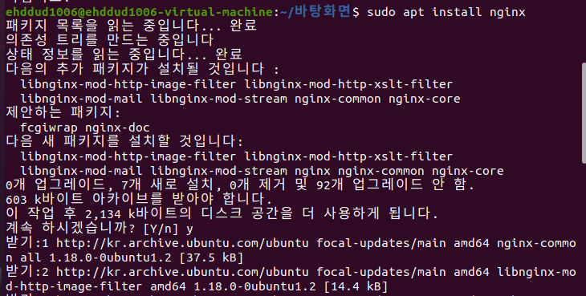
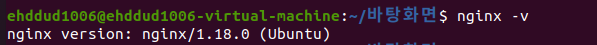
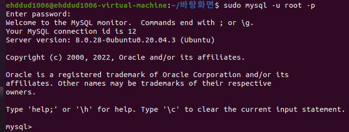
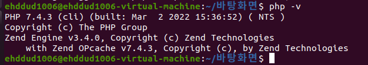
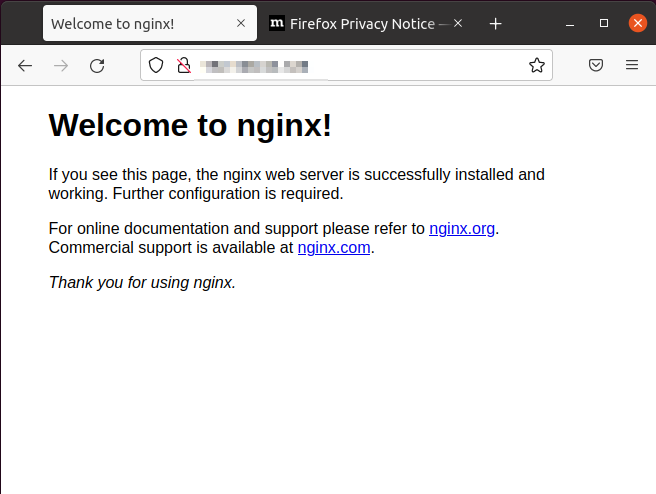
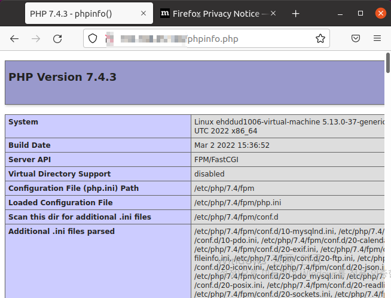
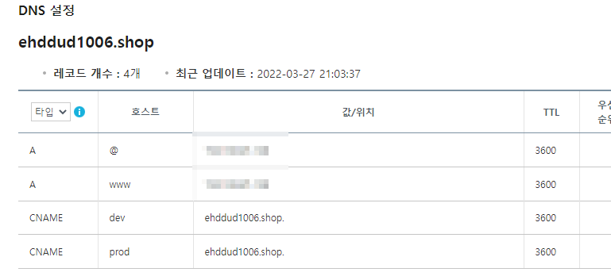
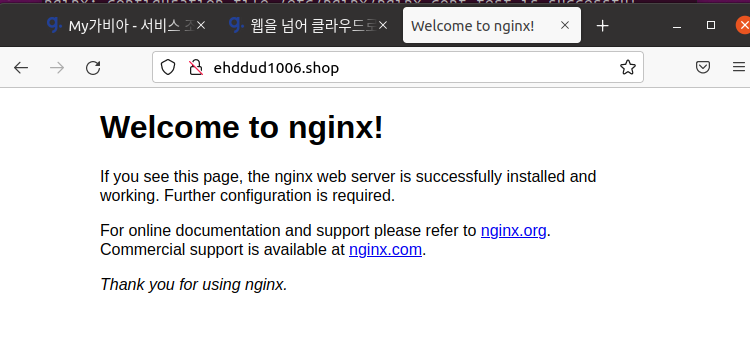
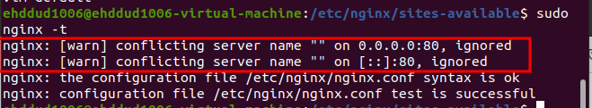
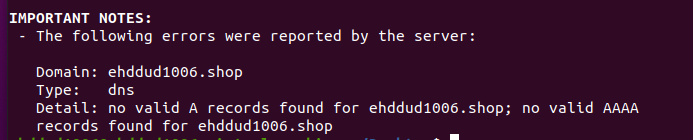

# PNU UMC Server Study 2주차

### https://ehddud100677.tistory.com/405

## 서브 도메인 이란?
서브 도메인은 보조 도메인으로써, URL로 전송하거나 계정 내의 IP 주소나 디렉토리로 포워딩되는 도메인 이름의 확장자이다

예를들어 네이버는 여러 서비스들을 아래와 같은 서브도메인을 통해 사용자가 접근할 수 있도록 한다.

네이버 블로그 : blog.naver.com
네이버 메일 : mail.naver.com
네이버 금융 : finance.naver.com

## 리다이렉션
어떤 특정한 ip 나 도메인으로 클라이언트가 접속할 경우 

서버에서 정한 주소로 바꿔주는 경우를 의미한다.

## 데스크탑에 VMWARE 설치.
노트북에는 설치되어있었지만 데스크탑에 설치하고 싶어서 

다시  VMWARE와 UBUNTU를 설치했습니다.

VirtualBox로 첫 시도를 했는데.. 이상하게 오류가 나더라구요 

그래서 VmWare로 갈아 탔습니다.

## nginx, php, mysql 설치

도메인 연결되는데 시간이 조금 소요된다.

## Challenge

오류나서 현재 해결중입니다.
