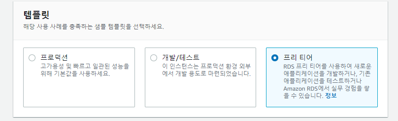

# PNU UMC Server Study 4주차
## 강의
### RDBMS란
관계형 db를 관리하는 시스템이라고 직역해도 무관하다.   
관계형이라는 키워드를 처음 접할 때 이해가 바로 가지 않지만   
db를 몸으로 느끼면 쉽게 이해할 수 있다.   
비관계형인 NoSQL과 비교한다면 더욱 쉽게 알 수 있는데,   
바로 foreign key의 유무이다.   

### DDL, DML, DCL
db에서 사용하는 언어를 분류한 것이다.   
명령어를 구분한 것 같음. 마지막 L은 Language이다.   
* DDL : 데이터 정의어, CREATE, ALTER, DROP, RENAME
* DML : 데이터 조작어, SELECT, INSERT, UPDATE, DELETE
* DCL : 데이터 제어어, GRANT, REVOKE
가장 많이 보는 것은 DML 그다음은 DDL이다.   
DCL은 써본적이 없다.   

### 인스타그랩 DB 설계 실습
가장 중요한 내용은 1:1, 1:N, N:M 이라고 생각한다.
테이블과 테이블의 관계를 파악하고 적절한 foreign key를 주어   
관계를 맺는것이 가장 중요하다.
django에서도 관계에 따라 주는 key가 다름.   

### RDS
aws에서는 RDS를 지원해준다.   
다른 db는 서로 접근이 불가능한데   
aws에서는 접근을 가능하게 해주어 다른 db에서도 data를 가져올 수 있게 해준다.   

---
## 실습(챌런지 과제)
중요한 포인트만 정리하겠습니다.   

### RDS 생성
   

Mysql을 사용한다.    

   

돈은 언제나 중요하다. 프리 티어를 골라 불상사를 막자.    

  

마스터 사용자 이름은 우리가 아는 mysql의 최상위권 사용자 이름을 말하는 것이다.    
나중에
```
$ mysql -u 사용자명 -p -h Host주소
```
에서 사용자명을 담당한다.   


사진에는 t3.micro를 골랐습니다.   
인스턴스 클래스에 따라 db의 속도나 성능이 달라지는 것으로 확인했습니다.   
혹시나 하는 마음에 가격 정책을 찾아봤는데 맨하단에 있더라고요.   


바로 t2.micro로 바꾸었습니다.


나중에 ec2에서 rds로 접속하기 위해 미리 보안 그룹을 만듭니다.   

### Datagrip으로 rds 접속
Jetbrain에서 제공하는 Datagrip은 db 전용 도구이다.   
근데 유료다.   
대부분의 cs 도구들이 그렇듯이, 학생에게는 무료이다.   


바로 인증해서 For educational use only로 바꾸어 주었다.   


Host는 RDS의 엔드 포인트
User와 password는 rds 만들 때의 마스터 유저 정보이다.   

위의 사진과 같이 정상적으로 접속되는 모습이다.   

### 파라미터 정보 수정

사용에는 문제가 없지만   
db의 시간(서울로 바꾸어주어야 함) 이나   
유니코드 설정을 위해서는 RDS의 정보를 수정할 필요가 있다.   
이를 파라미터로 관리를 한다.   

그러나 default의 parameter 그룹은 수정이 불가능 하기 때문에   
새로운 parameter 그룹을 만들어서 적용시켜야 한다.   


생성하고.   


time_zone의 서울로 바꿔주며

사진을 실수로 찍지 않았는데   
character_set 과 collation 부분을 전체
"utf8mb4_general_cli"로 바꿨다.   

utf8은 이모지 사용 불가한데, utf8mb4는 가능하고   
utf8은 가변 3바이트, utf8mb4는 4바이트라는 점에서 다르다.


이후 새로 만든 파라미터 그룹을 RDS에 적용시켜 주자.   


시간도 정상적으로 한국 시간이 찍힌다.   


test 삼아 넣은 한글 데이터도 깨지지 않는다.   

### ec2에서 접속
ec2 인스턴스 접속 후에
```
$ mysql -u 사용자명 -p -h Host주소
```
로 접속하자. 안될 것이다.

이는 보안 그룹 설정을 하지 않았기 때문이다.   

RDS를 위해 만든 VPC 보안 그룹에
ec2 인스턴스 보안 그룹을 넣어주다.

이 후


정상적으로 ec2에서 접속이 가능했다.   