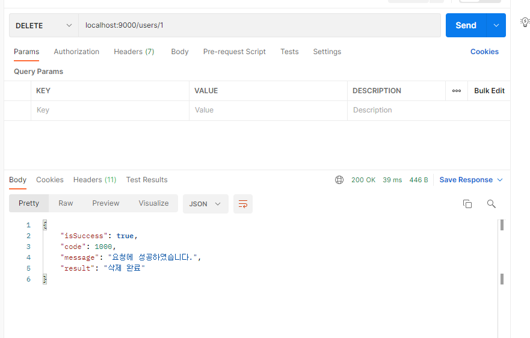
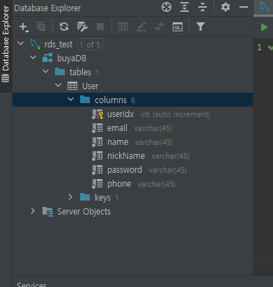

# PNU UMC Server Study 7주차
## Controller Anotation의 종류
**1) `@RestController`**

`@RestController` = `@Controller` + `@ResponseBody`   
`@Controller` 는 기본적으로 View를 반환하기 위해 사용하는 Annotation이다.    
여기에 Rest 통신을 위해 json으로 response하기 위해 `@ResponseBody`을 각 메소드 별로 붙혀 사용하는데    
이때, 두번 annotation 사용하느니, 하나로 줄인 것이 바로 `@RestController`이다.
    
그러므로, 이번 실습 코드에서 각 메소드 별로 `@ResponseBody` 없애도 된다.    
이미 Controller class는 `@RestController` 선언 되어 있으므로.    
```java
    //Query String
    @GetMapping("") // (GET) 127.0.0.1:9000/users
    // @Responsebody
    public BaseResponse<GetUserRes> getUsers(@RequestParam(required = true) String Email) {
        try{
            // TODO: email 관련한 짧은 validation 예시입니다. 그 외 더 부가적으로 추가해주세요!
            if(Email.length()==0){
                return new BaseResponse<>(POST_USERS_EMPTY_EMAIL);
            }
            // 이메일 정규표현
            if(!isRegexEmail(Email)){
                return new BaseResponse<>(POST_USERS_INVALID_EMAIL);
            }
            GetUserRes getUsersRes = userProvider.getUsersByEmail(Email);
            return new BaseResponse<>(getUsersRes);
        } catch(BaseException exception){
            return new BaseResponse<>((exception.getStatus()));
        }
    }
```

**2) `@RequestMapping`**

요청에 대해 어떤 Controller나 Method가 처리할 지 매핑하는 annotation이다.      
Sprint 4.3 부터는 `@RequestMapping` 별로 인자로 method를 넣을 필요 없고   
Method 별로 Annotation이 분리되었다.   

4.2 이전에는 아래와 같고,    
```java
@RequestMapping(value="", method=@RequestMethod.GET)
```

4.3 부터는 아래와 같다.   
```java
@GetMapping("")
```

확실히 더 코드 길이가 적다.   

추가적으로 클래스 레벨의 `@RequestMapping`도 존재 하는데,   
이는 아래의 method들을 하나의 url로 묶어두기 위함이다.    

**3) `@RequestBody`, `@RequestParam`, `@PathVariable`**

각 메소드 별로 어떻게 내용을 받을 것(Request의 구조)인가 정리하는 부분이다.   
`@RequestBody` 는 body로   
`@RequestParam` 는 query param으로   
`@PathVariable` 는 url param으로 받는다.   

## BaseResponse.java
Controller는 `@RestController`이므로 json으로 return 해준다.   
각 메소드의 return문을 보변 BaseResponse로 보내는 것을 볼 수 있는데,   
이 BaseResponse는 어떻게 작동하는 것일까.   

일단 `@ResponseBody` 이므로 객체로 return을 하면 json으로 변환해 return 하는 것은 맞다.    
그러나 추가적으로 BaseResponse.java를 통해 바꾸어 return 하는 이유는    
간단히 객체를 넘어 성공 여부, code, message 도 전달하기 위함이다.    
**jackson** 도 사용하고 있는데, 이는 json 순서와 null 처리하기 위해 사용한다.

## Bean과 `@Autowired` 그리고 DI(의존성 주입)

모르겠음    
 
## 챌런지 과제
유저 삭제 delete api 작성    

[여기](https://peterdaugaardrasmussen.com/2020/11/14/rest-should-you-use-a-body-for-your-http-delete-requests/)에 따르면 많은 사람들이 DELETE method에서는 body를 사용하는 것을 꺼려한다.   
그러므로 url param으로 idx를 받아 삭제하는 것으로 한다.   

```
    명세서
    URL : /users/:userIdx
    method : DELETE
    Response : 
        Boolean:IsSuccess
        Integer:code
        String:message
        String:result
```

```java
    // UserController.java
    /**
     * 유저삭제 API
     * [DELETE] /users/:userIdx
     * @return BaseResponse<DeleteUserRes>
     */
    @DeleteMapping("/{userIdx}")
    public BaseResponse<String> deleteUser(@PathVariable("userIdx")int userIdx) {
        try {
            DeleteUserReq deleteUserReq = new DeleteUserReq(userIdx);
            userService.deleteUser(deleteUserReq);

            String result = "삭제 완료";
            return new BaseResponse<>(result);
        } catch (BaseException exception) {
            return new BaseResponse<>((exception.getStatus()));
        }
    }

    // UserService.java
    public void deleteUser(DeleteUserReq deleteUserReq) throws BaseException {
        try {
            int result = userDao.deleteUser(deleteUserReq);
            if(result == 0) {
                throw new BaseException(DELETE_FAIL);
            }
        } catch(Exception exception) {
            throw new BaseException(DATABASE_ERROR);
        }
    }

    // UserDao.java
    public int deleteUser(DeleteUserReq deleteUserReq) {
        String deleteUserQuery = "delete from User WHERE userIdx = ?";
        Object[] deleteUserParams = new Object[]{deleteUserReq.getUserIdx()};

        return this.jdbcTemplate.update(deleteUserQuery, deleteUserParams);
    }
```

결과 : 
   
   
잘 됩니다.

## 추가 - 자동 테이블 생성
Django에서는 makemigrations와 migrate로    
model의 내용을 읽어 table을 만들어 매칭시켜 주었다.   
다만 현재 실습의 spring code에서는 이러한 기능이 없었기 때문에    
이를 적용하기 위해서 JPA를 추가하였다.    

**JPA**는 Java Persistence API의 준말로   
java ORM의 인터페이스 모음이다.   
사실 실습 코드에서도 JPA가 이미 build.gradle에 선언되어 있긴 한데,   
따로 사용하지 않은것 같다.    

JPA는 인터페이스의 모음집이지, 이를 구현한 것은 아니기 때문에   
모음집을 구현한 추가적인 오픈소스가 필요하다.   

사용할 수 있는 오픈 소스는 아래와 같다.   
* Hibernate
* EclipseLink
* DataNucleus

이 중 Hibernate를 사용한다.   

먼저 application.yml의 수정이 필요하다.   
```yml
spring:
  (...)
  jpa:
    open-in-view: true
    hibernate:
      ddl-auto: create
      naming:
        physical-strategy: org.hibernate.boot.model.naming.PhysicalNamingStrategyStandardImpl
      use-new-id-generator-mappings: false
    show-sql: true
    properties:
      hibernate:
        format_sql: true
```

`hibernate.ddl-auto`는 테이블을 만들기 전에   
`drop table if exists User` 명령어를 돌릴지 알아보는 코드이다.   
선택할 수 있는 옵션은 다음과 같다.   
* create : 있으면 삭제 후 다시 테이블 생성
* update : 수정 사항을 db에 반영
* none : 안함.

`hibernate.naming.pysicla-strategy`는 컬럼의 네이밍 규칙을 정할 수 있다.   
`PhysicalNamingStrategyStandardImpl`은 그대로   
`SpringPhysicalNamingStrategy`은 snake_case로 바꾸어 준다.    

`hibernate.use-new-id-generator-mapping`은 id 규칙이다.   
true면 jpa의 기본 전략을 따르게 되, class 내부에 정해준 id를 따라가지 않고   
false일 경우 클래스 내부의 id를 따라가게 된다.   

`show-sql`과 `hibernate.format_sql`은 콘솔에 사용할 sql문을 보여줄지에 대한 내용이다.   
위와 같이 설정하면 정렬되어 sql문을 볼 수 있다.   

그 다음 model의 User.java의 수정이 필요하다.    
사실 이번 실습의 User.java의 역활은 Controller에서 변경 API의 request body만 지정됬을 뿐이였기 때문에   
여기에 추가적으로 수정을 가해도 됬었다.   

수정된 User.java는 아래와 같다.   
```java
@Getter
@Setter
@NoArgsConstructor
@AllArgsConstructor
@Entity
@Table(name = "User")
public class User {

    @Id
    @GeneratedValue(strategy = GenerationType.IDENTITY)
    private int userIdx;

    @Column(nullable = false, length = 45)
    private String name;

    @Column(nullable = false, length = 45)
    private String nickName;

    @Column(nullable = false, length = 45)
    private String phone;

    @Column(nullable = false, length = 45)
    private String email;

    @Column(nullable = false, length = 45)
    private String password;
}
```

추가된 annotation을 하나씩 보자.   

`@Entity`는 이 클래스를 jpa model Entity로 보겠다는 annotation이다.   
`@Table`는 연결될 table의 이름을 지정해주는 annotation이다.

`@Id`는 다들 알다시피 primary key 지정,   
`@GeneratedValue`는 매핑전략을 지정해준다.   
보통은 IDENTITY를 사용한다.    
id 값을 null로 주면, 자동으로 auto_increment을 통해 id를 채워주게 된다.    

이렇게 바꿔준 뒤 run을 돌린다.    

     

먼저 table이 존재하지 않음을 확인하고   

    

run 하면 다음과 같이 `create table`을 통해 새로 table을 만들어준다.   


     

정상적으로 table이 만들어졌음을 볼 수 있다.    

    

기존의 회원가입 api도 정상적으로 작동한다.     