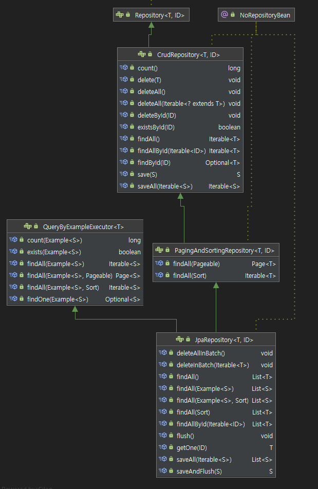

# PNU UMC Server Study 9주차
## Repository에서 Patch
Repository에서는 CRUD method가 전부 구현되어 있다.(정확히는 CRUDRepository에)   

그렇기 때문에 가장 기본적인 api인   
* Create - save()
* Read - find()
* Update - save()
* Delete - delete()

는 위와 같은 함수명을 시작으로 구현되어 있다.   
보통 ID를 받아 관련된 작업을 하는 method는 구현되어 있다.   

    

위의 사진이 JPARepository의 구조이다.   

그런데 Create와 Update의 method가 save()로 같은 것을 볼 수 있다.   
이는 save() 하나가 알아서 두개의 method를 구분해 작동하도록 되어있기 때문이다.   

인자로 준 도메인 객체에 이미 id값이 존재한다면 Update,   
아니라면 새로 만드는 Create를 한다.   

PUT일 경우에는 구현이 쉽다.   
애초에 PUT은 모든 값을 다 받아야만 되므로   
```java
findById(idx) -> User.update() -> save(user)    
```

의 순서로 정말 간단하게 구현이 가능하다.   

문제는 값을 다 안주어도 가능한 PATCH이다.   

상대적으로 PATCH가 PUT에 비해 body 길이도 작고 간단하므로    
대부분 PUT이 아닌 PATCH를 사용하는 것으로 안다.   

그러나 PATCH를 사용할 때 조금 애로사항이 있는데   
고민을 했던 부분은 다음과 같다.   

```java
public void update(UserDto.UpdateUserReq dto) {
    this.name = dto.getName();    
    this.nickName = dto.getNickName();
    this.phone = dto.getPhone();
    this.email = dto.getEmail();
    this.password = dto.getPassword();
}
```

메소드가 PUT일 때에   
보통 도메인의 Update 함수는 위와 같이 구현된다.   

문제는 PATCH인데 PATCH는 PUT에 비해 몇 attribute를 빠진 채로 dto를 가지게 된다.   
(아니면 DTO를 몇 column을 빠진채로 정의하거나)   

그렇게 되면 위의 update 함수는 의도대로는 작동되지는 않을 것이다.   
없는 getter 라면서 오류를 낼 것이다.   

User 객체를 받아온 후 각 attribute를 setter로 수정하고 싶지만   
setter를 사용하면 안되니 이 방법도 안된다.   

고심끝에 내린 결론으로는    
만들 PATCH 메소드 별로 update 함수를 하나씩 만들어야 한다는 결론이다.  
어쩐지 Spring에서는 다들 PUT을 사용하는 이유가 있었다.   

```java
@Getter
@NoArgsConstructor(access = AccessLevel.PROTECTED)
public static class UpdateUserNameReq {
    private String nickName;

    @Builder
    public UpdateUserNameReq(String nickName) {
        this.nickName = nickName;
    }
}

public void updateName(UserDto.UpdateUserNameReq dto) {
    this.nickName = dto.getNickName();
}
```

위의 DTO와 도메인 method 처럼 만들 PATCH 함수 별로 하나씩 만들어야 한다.   

## 외래키 관리
jpa에서 외래키를 사용할 때 가장 많이 나오는 개념이 있다.

`주인, 단방향, 양방향`

`단방향`은 두 도메인이 관계를 맺을 때, 한 쪽에서만 참조하고 있는 것을 말하고   
`양방향`은 양 쪽다 참조하고 있는 것을 말한다.   

일단 이를 설명하기 위해 UserFeed를 구현해보겠다.   
```java
@Getter
@NoArgsConstructor(access = AccessLevel.PROTECTED)
@Entity
@Table(name = "User")
public class User extends BaseEntity {
    @Column(nullable = false, length = 45)
    private String name;

    @Column(nullable = false, length = 45)
    private String nickName;

    @Column(nullable = false, length = 45)
    private String phone;

    @Column(nullable = false, length = 45)
    private String email;

    @Column(nullable = false, length = 256)
    private String password;
}

@Getter
@NoArgsConstructor(access = AccessLevel.PROTECTED)
@Entity
@Table(name = "UserFeed")
public class UserFeed extends BaseEntity {
    @ManyToOne
    @JoinColumn(name = "User_id")
    private User user;

    @Column(nullable = false, length = 300)
    private String imgUrl;

    @Column(nullable = false, length = 300)
    private String introduction;

    @Column(nullable = false)
    private Long follwerCount
}
```

외래키를 만들 때 먼저 중요한 것은 어디가 다(多)일지 정하는 것이다.   
Feed는 유저가 쓰는 글이니까, Feed가 다 이다.   

그러므로 UserFeed의 column에 `@ManyToOne`을 넣어 외래키를 관리하게 한다.   
이 때, 이 외래키를 가지고 있는 도메인이 `주인`이고   
`단방향` 일 때 보통 다(多)인 도메인이 외래키를 가진다.   

결론적으로 정리하자면
```
다(多) == 주인 == 외래키 관리
```

이다.   

단방향일 때, 미리 지정된 방향이 아닌 역방향으로 접근할 수 없다.   
즉 Feed에서 User로는 접근이 가능하지만   
User에서 Feed로는 접근을 할 수 없다.   

이를 해결하기 위해 양방향을 사용한다.   
```java
@Getter
@NoArgsConstructor(access = AccessLevel.PROTECTED)
@Entity
@Table(name = "User")
public class User extends BaseEntity {
    @Column(nullable = false, length = 45)
    private String name;

    @Column(nullable = false, length = 45)
    private String nickName;

    @Column(nullable = false, length = 45)
    private String phone;

    @Column(nullable = false, length = 45)
    private String email;

    @Column(nullable = false, length = 256)
    private String password;

    @OneToMany(mappedBy="user")
    private List<UserFeed> userFeeds = new ArrayList<UserFeed>();
}

@Getter
@NoArgsConstructor(access = AccessLevel.PROTECTED)
@Entity
@Table(name = "UserFeed")
public class UserFeed extends BaseEntity {
    @ManyToOne
    @JoinColumn(name = "User_id")
    private User user;

    @Column(nullable = false, length = 300)
    private String imgUrl;

    @Column(nullable = false, length = 300)
    private String introduction;

    @Column(nullable = false)
    private Long follwerCount
}

```

위의 코드와 같이 User에 `@OneToMany`가 추가된 모습이다.   
`@OneToMany`에서 mappedBy의 값은 주인에서 어떤 변수가 일을 참고하고 있는지 적는 내용이다.   
`User user` 이므로 user을 넣는다.   

그럼 단방향을 사용해야 할지, 아니면 양방향을 사용해야 할지   
어떻게 구분할 수 있을까?   

내 의견으로는 먼저 단방향으로 정의한 후에 사용하다가   
필요할 때 양방향으로 바꾸면 될 것 같다.   

jpa의 장점이 도메인 내용의 변경이 쉽다는 점이니까   
이를 살려서 뒤에 `@OneToMany`만 추가해 주자.

---
다른 서버 프레임워크랑 비교해보자면   
node.js는 기억이 안나므로 `pass`하고
Django는 기본적으로 단방향만을 지원한다.   

대신 단방향을 지정하는 동시에 역참조 할 수 있는 함수도 준다.   
그러나 양방향으로 참조를 걸어버리면 loop 참조(diamond 구조)라면서 오류를 내뱉는다.   
이를 유의하면서 각자 사용하자.