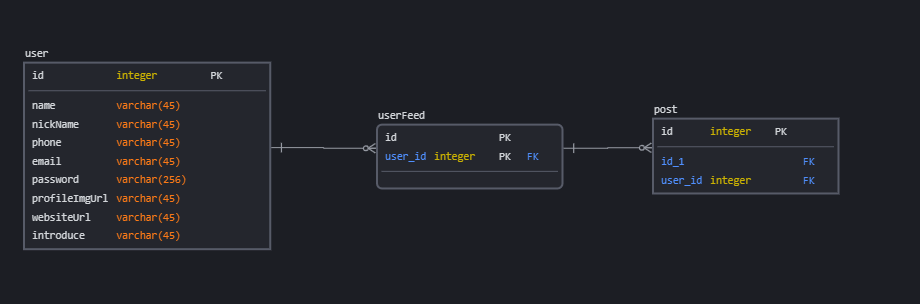
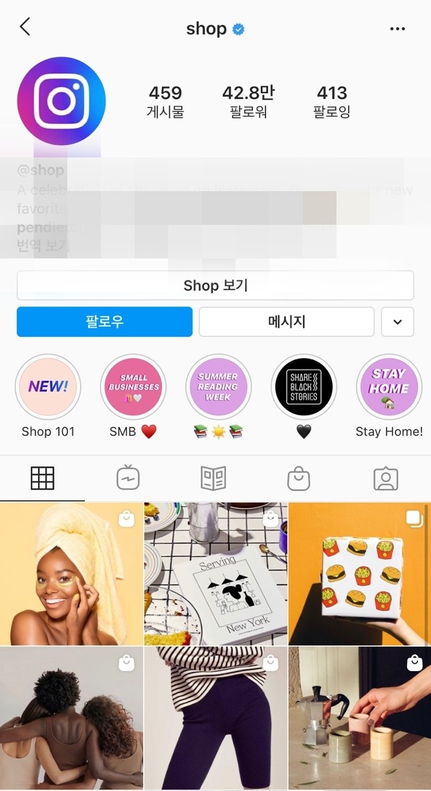
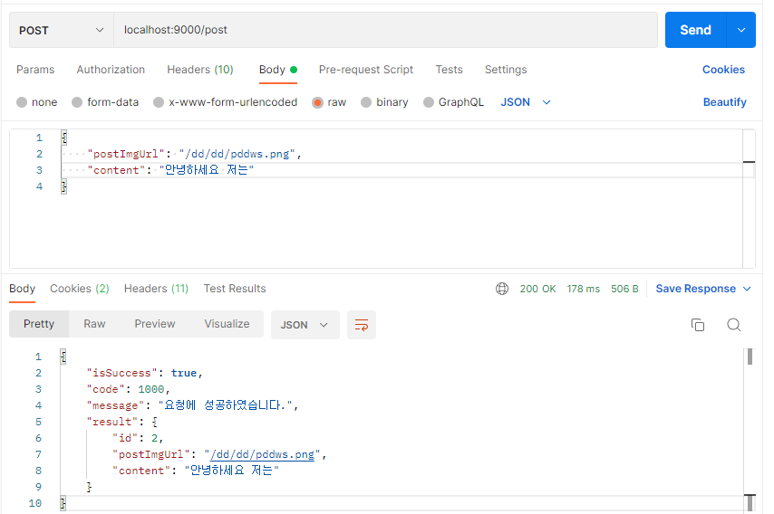
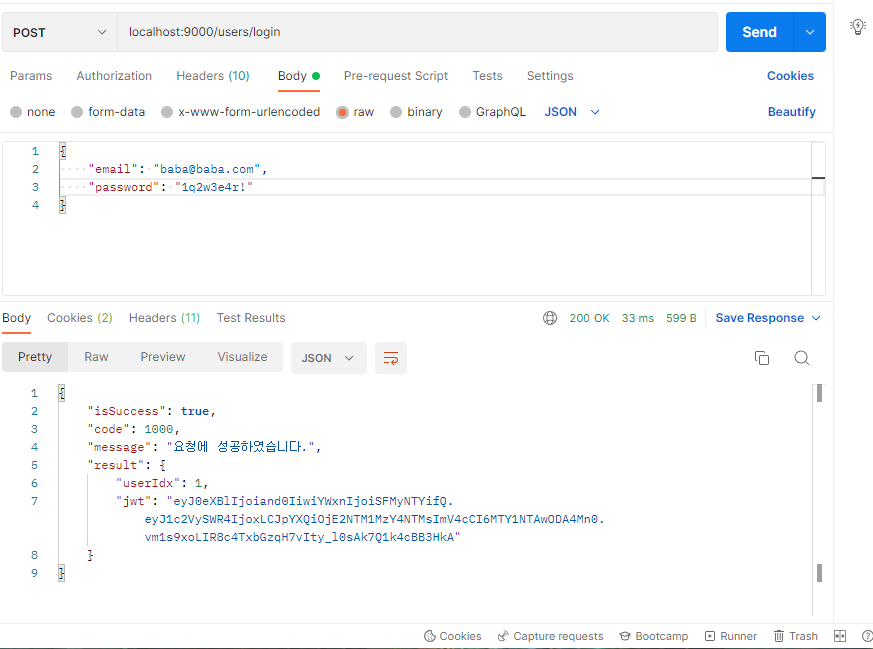
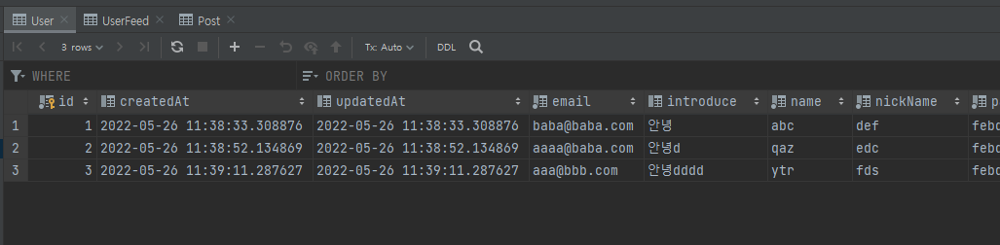
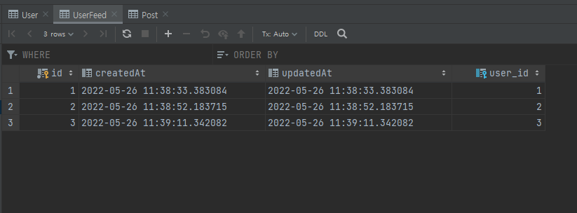
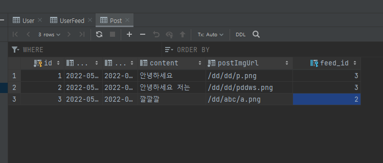

# PNU UMC Server Study 10주차
## 모델 확장
User 도메인만 존재하던 상태에서   
게시물을 관리하는 Post,   
둘을 이어주는 UserFeed를 제작했다.

    

구조는 이러하지만 더 자세한 설명을 아래에다 한다.   

```java
@Getter
@NoArgsConstructor(access = AccessLevel.PROTECTED)
@Entity
@Table(name = "User")
public class User extends BaseEntity {
    @Column(nullable = false, length = 45)
    private String name;

    @Column(nullable = false, length = 45)
    private String nickName;

    @Column(nullable = false, length = 45)
    private String phone;

    @Column(nullable = false, length = 45)
    private String email;

    @Column(nullable = false, length = 256)
    private String password;

    @Column()
    private String profileImgUrl;

    @Column()
    private String websiteUrl;

    @Lob
    private String introduce;

    ...

}
```

처음 UserFeed에 있던 profileImgUrl, websiteUrl, introduce는 피드가 가지고 있는게 아니라   
User가 가지고 있는 data를 가져오는 것이 맞다고 생각해   
3개의 data를 User로 옮겨 주었다.   

```java
@Getter
@NoArgsConstructor(access = AccessLevel.PROTECTED)
@Entity
@Table(name = "UserFeed")
public class UserFeed extends BaseEntity {
    @OneToOne(cascade = CascadeType.ALL)
    @JoinColumn(name = "user_id")
    private User user;

    @OneToMany(mappedBy="userFeed")
    private List<Post> posts = new ArrayList<Post>();

    ...

}
```

UserFeed는 User와 Post를 이어주는 관계 table이다.   
동시에 둘의 정보를 동시에 보여주어야 하기 때문에 이렇게 짰다.   

    

위는 인스타 피드의 화면인데   
윗 상단은 User의 data고   
아래는 게시물(Post)의 data이다.    

둘을 동시에 보여줄 필요가 있으므로 둘에 대한 Foreign Key를 가지고 있어야 한다.   

```java
@Getter
@NoArgsConstructor(access = AccessLevel.PROTECTED)
@Entity
@Table(name = "Post")
public class Post extends BaseEntity {
    @ManyToOne(cascade = CascadeType.ALL)
    @JoinColumn(name = "feed_id")
    private UserFeed userFeed;

    @Column(nullable = false)
    private String postImgUrl;

    @Lob
    private String content;

    ...

}
```
마지막으로 Post이다.   
각 Attribute 별로 설명할 부분은 없지만   
외래키 설정에 관한 이야기는 해야할거 같아서 한다.   

지금 현재 외래키는    
User - UserFeed는 1대1 단방향으로 UserFeed가 주인   
UserFeed - Post는 1대다 양방향으로 Post가 주인이다.

User-UserFeed에서는 User가 UserFeed의 내용을 알 필요가 없기 때문에 단방향으로 설계했다.   

그러나 UserFeed-User에서는 UserFeed가 Post의 내용을 알아야 한다.   
이는 위의 인스타 피드 처럼 User과 UserFeed의 내용을 정리할 수 있어야 하기 때문이다.   
그렇기 때문에 이 관계에서는 양방향으로 확장해주었다.   

## 결과
    
    

글 입력 POST, 로그인 api 둘다 잘된다.

    
    
    

UserFeed는 User의 수와 맞추어 생성되고   
Post는 create 될때 마다 UserFeed의 id를 가진다.   

## Trasanction
DB에서 Transaction은 하나의 방법인 것처럼 처리되어야 한다.   
지금 내 코드에서는 Post 게시물이 올라올 때 다음과 같은 작업을 한다.

```
사용자의 UserFeed 찾기 -> Post Create -> 찾은 UserFeed에 방금 만든 Post 추가
```

총 3개의 repository method에 접근하게 된다.   

만약 마지막의 UserFeed의 Post 추가에서 오류가 발생했다면   
미리 해두었던 Post Create를 rollback 해야 한다.   

이 때 사용하는 것이 @Transactional이다.   
Transaction을 적용할 method에 이 Annotation을 기입하라고 하는데    

너무 어렵다.    

이 부분은 뒤에 해결하는 걸로   